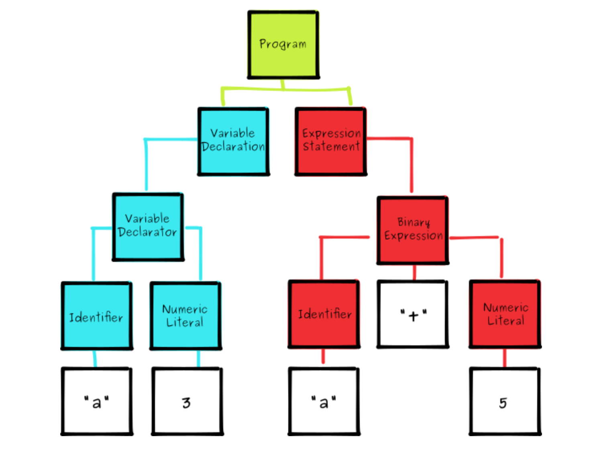

# SQL工具
## 1. calcite
    - slideShare: https://www.slideshare.net/JordanHalterman/introduction-to-apache-calcite?next_slideshow=1
    - slideShared: https://www.slideshare.net/julianhyde/streaming-sql-with-apache-calcite
## 2. Auto gen code
- io.swagger-codegen-maven-plugin(Ref: athenax)
    
   ` <sourceDirectory>src/main/java</sourceDirectory>
    <plugins>
      <plugin>
        <groupId>io.swagger</groupId>
        <artifactId>swagger-codegen-maven-plugin</artifactId>
        <executions>
          <execution>
            <goals>
              <goal>generate</goal>
            </goals>
            <configuration>
              <inputSpec>${project.basedir}/src/main/resources/athenax-backend-api.yaml</inputSpec>
              <language>jaxrs</language>
              <output>target/swagger</output>
              <modelPackage>com.uber.athenax.backend.api</modelPackage>
              <apiPackage>com.uber.athenax.backend.api</apiPackage>
              <invokerPackage>com.uber.athenax.backend.api</invokerPackage>
              <ignoreFileOverride>${project.basedir}/src/main/resources/.swagger-codegen-ignore</ignoreFileOverride>
              <supportingFilesToGenerate>NotFoundException.java,ApiException.java,ApiResponseMessage.java</supportingFilesToGenerate>
              <configOptions>
                <dateLibrary>java8</dateLibrary>
                <library>jersey1</library>
              </configOptions>
              <addCompileSourceRoot>false</addCompileSourceRoot>
            </configuration>
          </execution>
        </executions>
      </plugin>
`

- googlecode.fmpp-maven-plugin

### 3. Calcite原理
1. Sql Parser: 将sql语句通过java cc解析成AST(语法树),在calcite中用SqlNode表示AST
2. Sql Validator: 结合数字字典(catalog)去验证sql语法
3. 生成Logical Plan: 将sqlNode表示的AST转换成LogicalPlan, 用relNode表示
4. 生成 optimized LogicalPlan: 先基于calcite rules 去优化logical Plan, 通过一定的rule去优化logical plan
5. 生成PyisicalPlan
6. 将物理执行计划转成ExecutionPlan: 就是调用相应的tanslateToPlan方法转换和利用CodeGen元编程成各种算子。
7. AST语法树示例：

